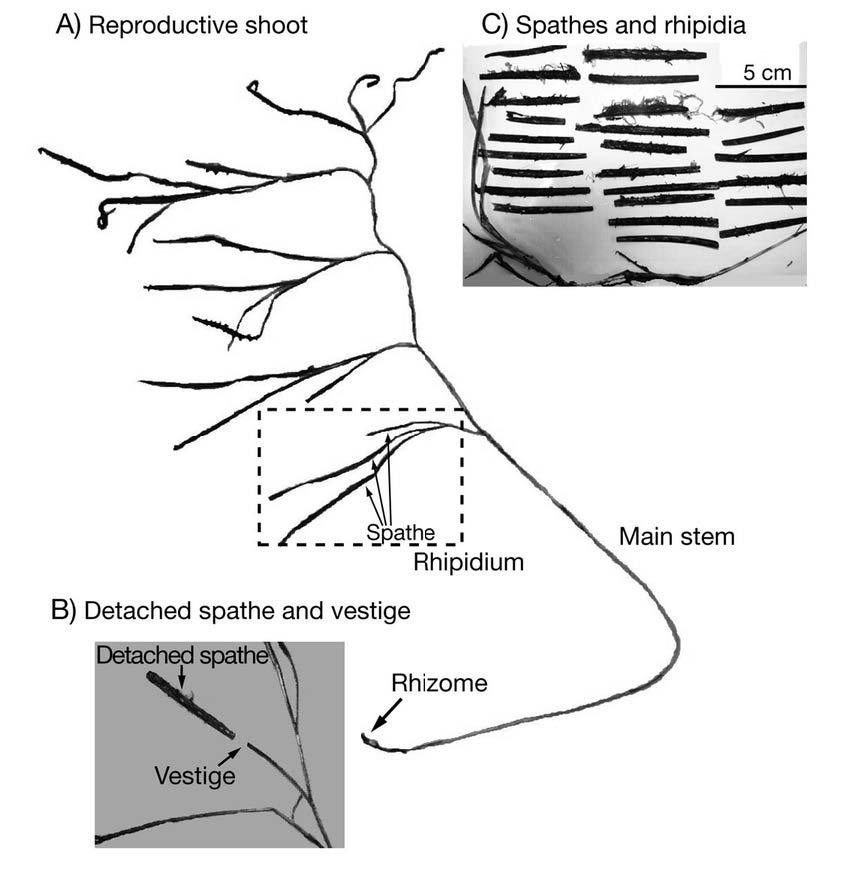

```{r setup, include=FALSE}
knitr::opts_chunk$set(echo = TRUE,
                      fig.align = 'center',
                      fig.width = 5, fig.height = 4,
                      collapse = TRUE, comment = "#>")
```

# Introduction
In 2023, Casco Bay Estuary Partnership (CBEP) funded a seasonal survey of the
timing of flowering and seed set of eelgrass (*Zostera marina*) in Casco Bay.
Scientists call the seasonal timing of flowering and other life history events 
"phenology". So this study is a study of eelgrass phenology in Casco Bay, Maine. 

The field project was conducted by "Team Zostera", a growing coalition of people
interested in eelgrass in the region led by Glenn Page, of SustainaMetrix.

Field observations were conducted at two eelgrass beds near Portland, Maine, one
near East End Beach, in Portland, and off the north end of Mackworth Island, in
Falmouth.  The two sites are about 1.75 miles apart as the crow flies.

Team Zostera provided CBEP with a copy of the field data in early September of
2023. In this workbook, we assemble a "tidy" data frame based on the data, and
provide notes on challenges we had ingesting data entered into Excel.

A companion notebook (phenology_graphics.Rmd) continues the analysis with
graphical review of the data.

# Load Libraries
```{r libraries, message = FALSE, warning = FALSE}
library(tidyverse)
library(readxl)
#library(emmeans)   # For extracting useful "marginal" model summaries

theme_set(theme_bw())
```

## Explanation of Data
Data was collected following a protocol ("SOPs", or "Standard Operating 
Procedures") developed by Jillian Carr (of the Massachusetts Bays Program) and 
Phil Colarusso (Of EPA's Region 1 office, in Boston).  A copy of the protocol
is available by request to the Casco Bay Estuary Partnership.

For each sampling event, a minimum of five eelgrass flowering shoots were
collected.  For each shoot, each side-branch (formally called a "rhipidium") was
examined, in order from the bottom of the plant (oldest) to the top of the
plant (youngest).

Each side branch is a compound inflorescence, composed of multiple smaller
branchlets. On each side branch (formally, a "spathe"), the flowering stage of
each flowering branchlet was recorded. Order of branchlets (spathes) on the inflorescence (rhipidium) was not recorded.

Flowering stage was recorded as an ordered integer, with values from zero
(spathes developed, but styles not yet appeared) to six (seeds released, shoot
beginning to wither.)

```{r pressure, echo=FALSE, fig.cap="Eelgrass Flowering Shoot Morphology", out.width="50%"}

```

## Data Properties
The sampling protocol generates data with complex structure, including both 
nesting and order information that may be important.

### Nesting
The nesting structure of the data includes the following:

* Spathe, nested within 

* Rhodium, ordered within 

* Shoot, nested within 

* Date, nested within

* Site

Site and Date are not crossed, as only one site was sampled on most sampling
days.

# Read Data
Data was provided in an Excel file ("Eelgrass Sampling Data.xlsx") with separate
tabs for different sampling events.  The date and sampling locations are coded
in the names of the tabs.  That file is in the "Original Data" folder.

## Preparation of the Excel File
We hand edited the Excel file to address some data format inconsistencies,
producing "Eelgrass Sampling Data Amended.xlsx", which is also stored in the
"Original Data" folder.

Our hand edits included the following:

* deleting two tabs containing no data

* replacing narrative data description ("two spathes at stage 0, one at one") 
with corresponding data in comma delimited list format ("0,0,1") and removing 
the word "and" from multiple lists of values. Text values are not readily 
imported into R.

### Data Quality Issues
Four data quality questions arose during the data review and editing:

1.  A few rhipidia had no spathes.  It is not clear how to code them, as the
lack of spathes is useful information (suggesting either a non-flowering shoot
or a flowering shoot too immature to show inflorescence development).
Regardless, it is worth tracking this as distinct from a blank row in the data.
Here we coded them as a single value, Stage -99, to be replaced with `na` when
appropriate in data preparation.

2. Sometimes a spathe was observed, but data was not recorded because the
observers were uncertain how to score it. These are also treated as missing 
values, principally to retain correct spathe ordering.

3. In a few places, observers assigned spathes to intermediate stages, coding
them with dashes to indicate a range (e.g., "stage 4-5"). That coding is liable
to error, as it is very similar to separation of two numbers with a comma, so it
should be avoided.  For analysis purposes, we need to assign such intermediate
stage observations to one of the six designated stages.  Here, we arbitrarily
assigned them to the higher stage, and added a Note in the Excel data. This
mostly happened on one data sheet.

4. Excel appears to have a tendency to interpret comma delineated lists (or
hyphen- delimited lists) of two or three values as dates. This was only evident
after importing the data to R.  Excel has many ways of representing dates, and
some delimited lists are allowable date formats. In Excel, cell contents appear
indistinguishable from comma delimited lists, but internally and on import to R,
they appear as large integers. We could search for these false dates in Excel by
looking for cells formatted not as "General", but as "Custom".  We corrected
these cells by reformatting the cells and re-entering the data as a
comma delimited list.  Most of these import errors occurred on the July 5 data 
sheet.

## Data Tabs Contain Sampling Information
```{r}
subfolder <- 'Original Data'
fn <- "Eelgrass Sampling Data Amended.xlsx"
path <- file.path(subfolder, fn)
sheets <- excel_sheets(path)
sheets
```

To create "tidy" data, we need to iterate over each sheet, split off the 
dates and locations, and convert the written dates into formal Date objects.
Unfortunately, some dates include "th" suffixes, so we will have to handle this 
conversion carefully.

## The Logic of Extracting Data from Tab Names
(Note, similar data is recorded on each TAB, but not as part of the general data 
sheet format.  We could also pull this data as part of a general function for 
accessing the data off each data sheet.  For data quality reasons, we should 
probably do both and compare results, but that is beyond our current goals.)

```{r}
labs <- as_tibble(sheets) %>%
  filter(value != "Template")
labs
```

```{r}
(split_cols <- labs %>%
   separate_wider_delim(value, " - ", 
                       names =c("date_str", "location")))
```

Remove those pesky "th" suffixes.
```{r}
split_cols_2 <- split_cols %>%
  mutate(date_str = sub("th", "", date_str))
split_cols_2
```

Now, let's convert those to dates. We used generalized code here instead of hard
coding "June" and "July" in case in future we need to do this conversion for
more than just two months.  `month.name` is a built in R constant.

```{r}
split_cols_3 <- split_cols_2 %>%
  separate_wider_delim(date_str, " ", 
                       names =c("month_str", "day_str")) %>%
  mutate(month_num = as.character(match(month_str, month.name)),
         the_date = as.Date(paste0(month_num, "/", day_str, "/", "2023"),
                            format = "%m/%d/%Y")) %>%
  select(-month_str, -day_str, -month_num)
split_cols_3
```

## A Function to Convert Dates and Times
We need to extract sites and dates  while we load the data sheet by sheet. It is
therefore worth constructing a function to handle the conversion.  A function is
convenient because it allows one to automate the repetitive task of loading the
data.

```{r echo=FALSE}
rm(labs, split_cols, split_cols_2, split_cols_3)
```

Here is a small function to do the job, constructed for use in the Tidyverse.
This handles the "Template" tab appropriately, by generating `NA`.  It looks for 
the " - " in each tab title, and if it is missing, you end up with `NA`.

The following repeats the logic we previously developed, in the idiom necessary
to work within a Tidyverse workflow. In particular, the two parameters are a
data frame (or tibble) containing the original Tab labels, and the name of the
column within that data frame containing the labels.
```{r}
split_date_location = function(.data, tab_labels) {
 
  stopifnot(inherits(.data, 'data.frame'))     # minor data consistency check

  tab_labels <- rlang::enquo(tab_labels)
  labs <- rlang::eval_tidy(tab_labels, .data)  # This handles 
  stopifnot(is.character(labs))                # another data consistency check
  
  
 
  df <- dplyr::tibble(labs = labs) %>%
    separate_wider_delim(labs, " - ", 
                         names =c("date_str", "location"),
                         too_few = 'align_start') %>%
    mutate(date_str = sub("th", "", date_str)) %>%
    separate_wider_delim(date_str, " ", 
                         names =c("month_str", "day_str"),
                         too_few = 'align_start') %>%
    mutate(month_num = as.character(match(month_str, month.name)),
           the_date = as.Date(paste0(month_num, "/", day_str, "/", "2023"),
                            format = "%m/%d/%Y")) %>%
    select(-month_str, -day_str, -month_num)

  return(df)
}
```

```{r}
labs <- as_tibble(sheets)
labs

split_date_location(labs, value)
```

## Iterating over each sheet
We can use `lapply()` to efficiently iterate over all the data sheets and 
assemble a list of data frames.  We then convert that list into one large 
data frame using the Tidyverse's `bind_rows()` function.

The core coding idea is from
[Geeks for Geeks](https://www.geeksforgeeks.org/combine-multiple-excel-worksheets-into-single-dataframe-in-r/).
```{r}
subfolder <- 'Original Data'
fn <- "Eelgrass Sampling Data Amended.xlsx"
path <- file.path(subfolder, fn)

data_frame_list <- lapply(setNames(sheets, sheets), 
                    function(x) read_excel(path, sheet=x, range = "a9:c50",
                                           col_names = c("Shoot", 
                                                         "Rhipidium", 
                                                         "Spathe"),
                                           col_types = c("numeric", 
                                                         "numeric", 
                                                         "text")))
data_frame_list <- data_frame_list[-c(1, 9)]  

data_frame <- bind_rows(data_frame_list, .id="Sample") %>%
  fill(Shoot, .direction = 'down') %>%
  filter(! is.na(Spathe)) %>%
  mutate(Spathe = na_if(Spathe, "-99"))
```

## Separating Sampling Date and Sampling Locations
This shows why it was worth writing that short function....
```{r}
sample_info <- data_frame %>%
  split_date_location(Sample)

df <- sample_info %>%
  bind_cols(data_frame)
```

## Split Spathe-level Data Into Separate Rows
```{r}
the_data <- df %>%
  separate_longer_delim(Spathe, ",") %>%
  mutate(Spathe_num = as.numeric(Spathe))
```

### Last (?) Data Correction
The warning arises because one entry, from July 19th, Shoot 1, Rhipidium 4,
contained a comma-delimited list that ends in a comma, implying there should be
another value.  We have no way, based only on the Excel data of determining
whether the comma was an error or if a value is missing.  Here, we delete that
row, which is the same as assuming the comma should not have been there and here
was not another Spathe to observe.

```{r}
the_data <- the_data %>%
  filter(! (Sample == "July 19 - East End" &
             Shoot == 1 & 
             Rhipidium == 4 & 
             is.na(Spathe_num)))
```

# Save the Data

## Export File
```{r}
fn <- 'phenology_data_2023.csv'
subfolder <- 'Working Data'
path <- file.path(subfolder, fn)
write_csv(the_data, path)
```


